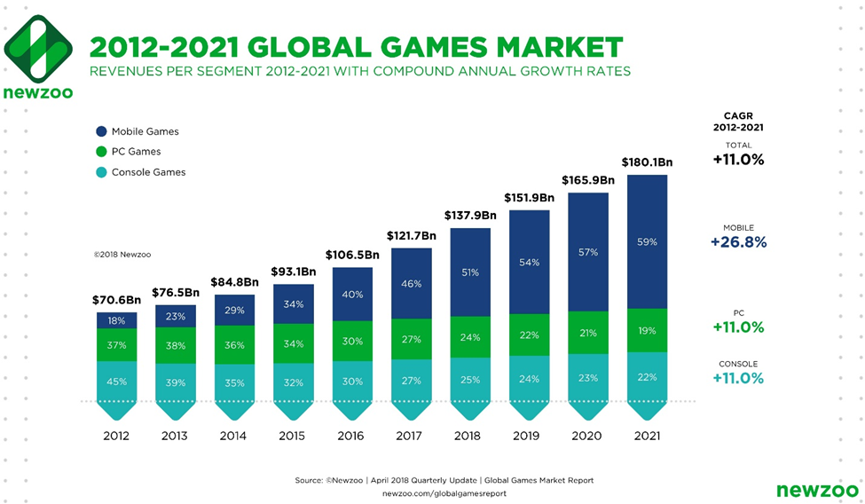

# Blockchain Gaming Market

Games are something that humankind uses to develop personality, logic and other traits essentials to survive. This happens since the dawn of humanity.

\
We surpass many different kinds of games and now we face the digitalization of games. The Gaming industry today has more value than the Cinematographic industry which leads us to a variety of opportunities.\
\
\
\
This multibillionaire industry has a lot of potential yet. The new segment of this industry is the Blockchain gaming with criptoassets, blockchain and play-to-earn mechanisms.


One of the most iconic games of this new segment is the Axie Infinity, which had a lot of attention, games and, of course, revenue. [Only Axie Infinity had US$ 1.3 billion in revenue in 2021.](https://finance.yahoo.com/news/top-nft-game-axie-infinity-140000481.html?.tsrc=fin-srch)


Blockchain games and P2E mechanisms are a good way to bring new people to the Gaming Industry and to recompensate the hours of gameplay, in a way that players, community and stakeholders of the company will gain.
