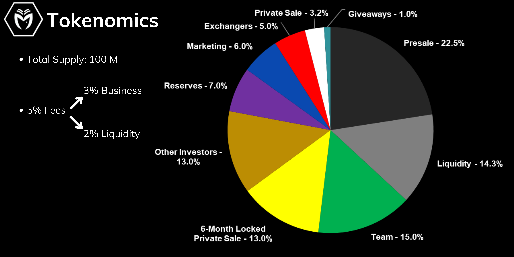

# Tokenomics

MDUSA is a crypto token on the Binance Smart Chains.

It is a token with a **fixed supply of 100 000 000 MDUSA tokens** (one hundred million).

In terms of transaction fees, **investing at MDUSA has a transfer fee of 5%, which is allocated for the business and liquidity purposes.**

3% of the fee is for business purposes, including marketing, team, structure and other expenditures;

2% of the fee is allocated to be added to the liquidity pool.

Our focus with these tokenomics is to explore volume and keep on consolidating and raising the liquidity of the MDUSA token.

This will also happen through the buybacks and burns of revenues from the projects within our ecosystem. &#x20;

