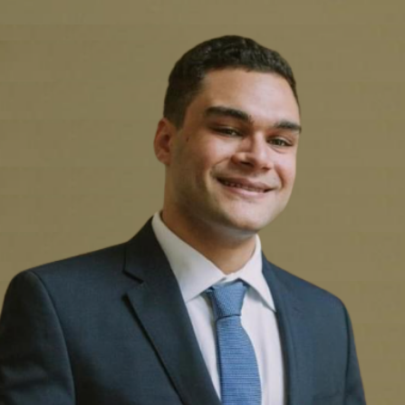

# The Team

We have been working together for the last year, a team of very ambitious and creative people excited with making Medusa Protocol, a leader at the Decentralized Finance Space.

The team is composed by:

* Duarte Baltazar - Management and Economics degrees. Banking experience.\
  
* Daniel Ascen - Economist and Crypto analyst. Worked as a Debt Researcher in Brazil.\
  
* Marco Antonio - Telecommunication Engineer and Blockchain Developer with experience in the field.\
  
* Lucas Philipovsky - Master Chemical Engineer, Designer and Game Developer.\
  
* David Caldeira - Electrotechnical Engineer with experience in e-commerce sales.\
  
