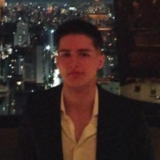
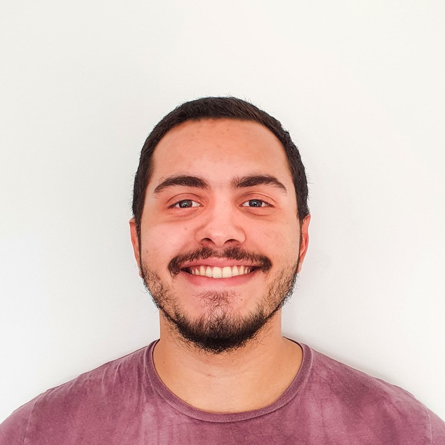

# The Team

We have been working together for the last year, a team of very ambitious and creative people excited with making Medusa Protocol, a leader at the Decentralized Finance Space.

Medusa Protocol is an international team, with full-time and partial time members committed in keep on taking the project and MDUSA token to bigger levels.

## Duarte Baltazar

Head of Medusa Protocol, based in Lisbon, Portugal. 24 years old.&#x20;

Co-founder of TaskPrints an online and offline graphic company; and Cuffies.

Previous experience on the banking industry, working as an advisor at Alantra in non-perfoming-loan's deals between investment funds and banks.

Duarte holds a Master of Science’s degree in Management with a specialization in Strategy and Entrepreneurship at Católica Lisbon School of Business and Economics and a Bachelor’s degree in Economics at Nova School of Business and Economics.

Feel free to contact him through **duarte.baltazar@medusaprotocol.com**.

\
.png>)

## Daniel Ascen

Partner and CFO at Medusa Protocol, based in Ceará, Brazil. 27 years old.&#x20;

Co-founder of Cuffies and with vast experience with cryptocurrency analysis. Manager of an online economic _think-thank._&#x20;

Daniel holds a Bachelor’s degree in Economics at Universidade Federal do Ceará, with a special focus on Bitcoin as an investment asset in an investment portfolio.&#x20;

His passion for the crypto DeFi market led him to be full time on Medusa Protocol. Direct responsible for the financial organization of the company.

Feel free to contact him through **daniel.ascen@medusaprotocol.com**.

\
Marco Failache
--------------

Partner and CTO at Medusa Protocol, based in Lisboa, Portugal. 25 years old. Marco holds a Master's Degree in Telecommunications Engineering, with his master thesis in 5G technology; and a Bachelor's Degree in Electrotechnical Engineering at IST University of Lisbon.

At Medusa, Marco works with blockchain and technological development, overseeing all activities on the different projects within Medusa Ecosystem.

Feel free to contact him through **marco.failache@medusaprotocol.com**.\
\

## Lucas Philipovsky

Chief of Game and Partner at Medusa, based in Ceará, Brazil. Lucas is a Brazilian Chemical Engineer, holding also a post-graduation in design.&#x20;

His passion for games and design, led him to be a fundamental part of Medusa Protocol. The main visionary around Celestia Game, Lucas is overseeing major developments on the game.

Feel free to contact him at lucas.philipovsky@medusaprotocol.com.\
\
&#x20;\

## David Caldeira

Partner and Strategist at Medusa Protocol, based in Lisboa, Portugal. 24 years old. He has been working on the team from start. Experience in ecommerce development and management; also a crypto enthusiast from the beginning.

David holds a Bachelor’s degree in Electrotechnical Engineering from IST University of Lisbon.

At Medusa, he works with direct responsibility on the strategy, operations and roadmap developments.

Feel free to contact him through **david.caldeira@medusaprotocol.com**.

\

