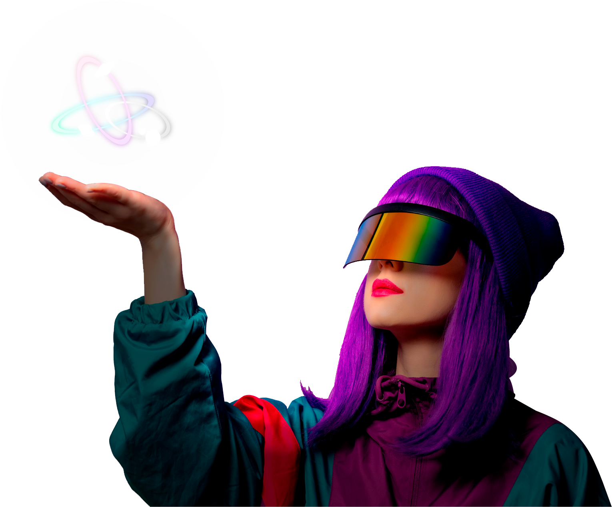

# Celestia Game

Celestia is an NFT card game powered by the blockchain and developed in Unity. \
\
Players compete in a strategy game that takes place in a central universe called "The Singularity". In The Singularity, entities like gods, goddesses, creatures, and even your own unique designs come together to battle for glory. \
\
Players initially are gifted a deck of cards and they may add NFT cards to their collection to synergize and power-up their decks. Our main focus will be on a Player Vs. Player system with online matchmaking services where players can P2E (play-to-earn) by winning fast-paced battles against real-time competitors.

.png>)

## True Digital Ownership

Celestia provides real ownership over in-game items by turning them into BEP-721 tokens/NFTs. Players gain the right to sell their items for real money, use them in Celestia, and even trade them within our ecosystem.

## Play to Earn

To catalyze competitive play and stimulate engagement, players can earn meaningful currencies and items, including the Binance Smart Chain (BSC - BEP-20) $Celestia token, by simply playing the game. The ability to earn tangible rewards serves as the key ingredient to supercharge our future growth.

## Economics

$Celestia tokens are designed to exist at the heart of the economy, being used by players to purchase new card packs and chests, craft their own NFT cards, and earn staking rewards. \
\
By including $Celestia in the key facets of the experience, it creates a sustainable ecosystem where players have the economic freedom to earn from, and contribute to the economy.

## Lore

> "It all started with Celeste, The Goddess of Creation. She was gifted an empty universe called "The Singularity" to impose her will on by the Cosmic Council - the group of MetaGods who are the multiverse incarnate. Celeste at heart is a playful young Goddess, so she created a dimension where all beings across the multiverse can be free to battle and earn a place in the ultimate showdown: The Tournament Of Champions. The Prize: a single Wish."

## It begins now

We are excited that the development of a P2E game will bring a good return for the ecosystem in terms of volume generation, NFT utility, E-sports, development of our userbase, and as a testament to the future of inclusive crypto integration in the mainstream. \
\
This will reinforce inside the game itself. With the power of the Medusa ecosystem, it is possible to develop and sponsor our gaming community to foster an exciting fandom on our own platform that will have the power to voice their inputs and bring Celestia to it's ultimate potential.\
\
To know more about the game, access our [website](https://celestiagame.com/).
