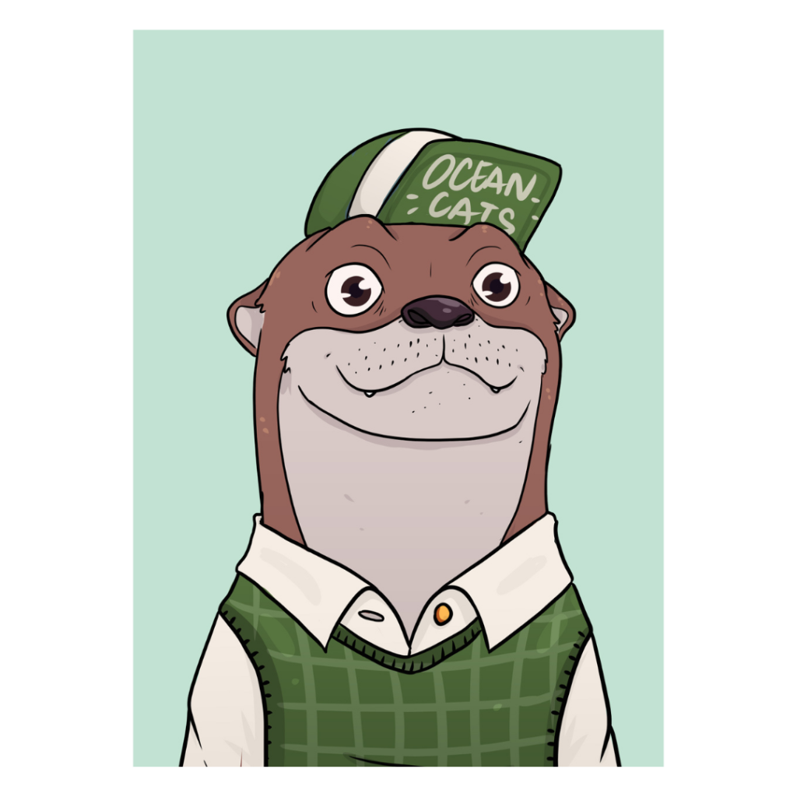

# OceanCats

OceanCats is a series of NFTs inspired by otters. This cute animal is a new phenomenon on social media with a lot of attention recently. The idea is to bring the fun of these animals with the final objective of preserving their lives.\
\
Our first series will be OceanCats School:&#x20;

> “At the school of otters, affectionately known as OceanCats, we came to show the world all this madness that was the school season with the fun that otters are capable of offering. More than NFTs, here we introduce the world to who we were when we were young. A link with the past so we don't forget that what we are today is due to what we were yesterday.”

\
The concept of cool NFTs is something that the new investors in the crypto scenario are liking to discover. Arts, in the traditional investment market, is a good protection against inflation and, some of the NFTs are gaining this sentiment. Of course, only the good arts, and, consequently, only the good NFTs. So, the idea is to bring a community and activities alongside the NFTs.

The first activity will be an animated series for the holders and community. Where, inspired by the first series of our NFTs, the OceanCats School, will represent otters in a school/college environment.

More activities and utilities will come with time to bring more value for our NFTs and make it more than just a market eccentricity.
