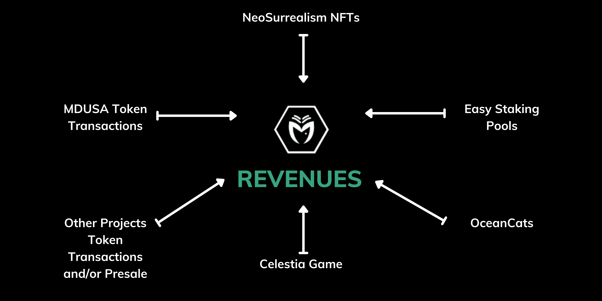

# Revenues of Medusa

From start, our focus has been on creating a cryptocurrency that could be powered by revenues. Like stocks in a public traded business.

The Medusa Ecosystem will feature several revenue streams based on its utilities.&#x20;

In MDUSA Token, we will take a 3% fee of the transactions as revenue for the company.&#x20;

We kept the token with a low fee, because our main source of revenues will not come from the transactions of the MDUSA token.


You can see the [tokenomics](../mdusa-token/mdusa-tokenomics.md) again if you skipped this part.


Our main source of revenues as a business comes from the projects under the Medusa scope.&#x20;

Every project within our ecosystem will have a percentage transaction fee flowing directly into MDUSA token, as buybacks and burns.&#x20;

In the case of OceanCats for example, a 20% share of the total revenues from NFT sales, merchandising and networking contracts, is distributed with holders of the MDUSA token.

Funds raised from different projects will be used to sustain and keep on growing the ecosystem.

From every created staking pool in our platform, we will charge 2% of the allocated tokens for the pool.&#x20;

Other revenues include our own Medusa's NFT sales, our Medusa's Liquidity Protocol earnings and a percentage of the raised funds for sub-projects ICO’s (depending on the activity of the project in question).

